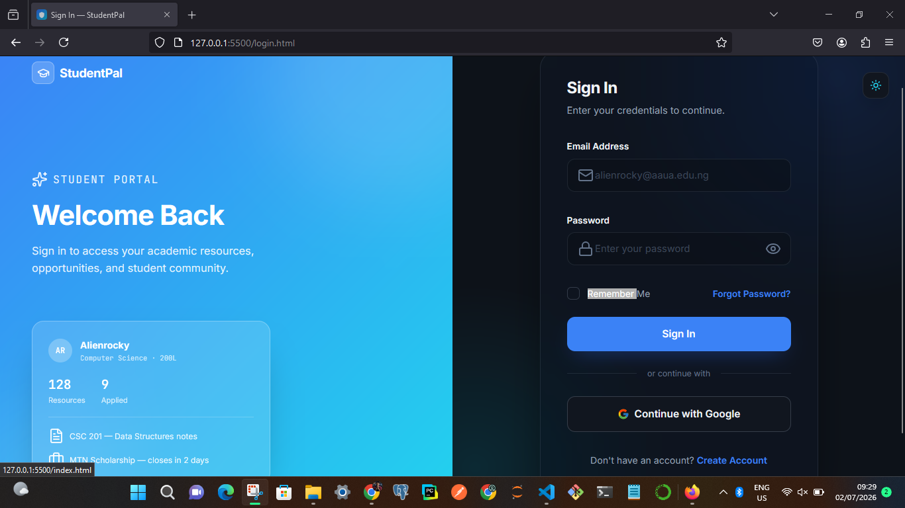

🎓 StudentPal

«A centralized academic platform built for the Faculty of Computing, Adekunle Ajasin University, Akungba-Akoko (AAUA).»

StudentPal is a modern web platform designed to simplify academic life by bringing lecture notes, past questions, faculty announcements, academic opportunities, assignments, and student services into one place.

The project was conceived to solve real challenges experienced by students in the Faculty of Computing and was already under active development before being selected for the DevCareer × Nomba Hackathon Build Phase.

---

Table of Contents

- About
- Problem Statement
- Solution
- Features
- System Roles
- Technology Stack
- Project Structure
- Installation
- Recent Development (July 5 – July 7)
- Screenshots
- Roadmap
- Future Improvements
- Author
- License

---

📌 Problem Statement

Students within the Faculty of Computing often struggle with:

- Finding lecture notes and handouts.
- Accessing past examination questions.
- Missing faculty announcements.
- Discovering internships, scholarships and competitions.
- Keeping track of academic deadlines.
- Switching between multiple WhatsApp groups and platforms just to find important information.

This scattered system wastes time and causes students to miss valuable academic opportunities.

---

💡 Solution

StudentPal provides one centralized platform where students can:

- Access verified academic resources.
- Stay informed with faculty announcements.
- Discover internships and scholarship opportunities.
- Track important academic dates.
- Engage with fellow students.
- Search resources quickly using AI-powered search (currently in development).

---

✨ Features

👨‍🎓 Student Features

- Secure Registration
- Secure Login (JWT-backed, connected to the live API)
- Personalized Dashboard
- Browse Academic Resources
- Download Lecture Notes
- Download Past Questions
- View Faculty Announcements
- Browse Opportunities
- Apply to Opportunities (Scholarships, Internships, Competitions, Ambassador Programs)
- Academic Calendar
- Community Discussions
- User Profile Management
- Light & Dark Theme

---

👨‍💼 Admin Features

- Dedicated Admin Login Portal (separate from student sign-in, role-gated)
- Admin Dashboard
- Upload Lecture Notes
- Upload Past Questions
- Manage Resources (edit, delete, track downloads)
- Create & Publish Announcements
- Manage Opportunities (create, delete, view applicants list)
- Manage Assignments
- Manage Students
- Platform Analytics

---

🤖 AI Features (In Development)

StudentPal is being enhanced with Artificial Intelligence to improve the student experience.

Planned AI capabilities include:

- AI Resource Search
- Intelligent Resource Recommendations
- Smart Search
- AI Study Assistant

---

👥 User Roles

Student

Students can:

- View Resources
- Download Files
- View Announcements
- Browse Opportunities
- Apply to Opportunities
- Participate in Community Discussions
- Manage Their Profile

Students cannot:

- Upload Resources
- Create Announcements
- Manage Other Users
- Publish or Delete Opportunities

---

Admin

Administrators can:

- Upload Resources
- Manage Resources
- Publish Announcements
- Create, Manage, and Track Opportunities
- View Opportunity Applicants
- Moderate Community Content
- View Platform Analytics

Admin accounts are no longer created through the public registration form. They are created exclusively via a dedicated management command (`create_admin`), which sets both the custom `role="admin"` field and Django's `is_staff` flag correctly in one step — closing a gap where manually-registered accounts could not pass permission checks.

---

🛠 Technology Stack

Frontend

- HTML5
- CSS3
- JavaScript (Fetch API — no frameworks)

Backend

- Django
- Django REST Framework (DRF)

Authentication

- JWT Authentication (access + refresh tokens, blacklist-on-logout)
- Custom User model (email-based login, custom `role` field)

Database

- PostgreSQL (Development)

Version Control

- Git
- GitHub

---

📂 Project Structure

StudentPal
frontend
    index.html
    login.html
    admin-login.html
    register.html
    student-dashboard.html
    admin-dashboard.html
    resources.html
    announcements.html
    opportunities.html
    assignments.html
    academic-calendar.html
    settings.html
    static/js
        api.js
        api-opportunities.js
        auth-guard.js
        admin.js
        admin-resources.js
        admin-opportunities.js
        student-content.js
        student-opportunities.js
        admin-login.js
        login.js
        register.js
backend
    accounts
        models.py
        serializers.py
        views.py
        urls.py
        permissions.py
        management/commands/create_admin.py
    resources
        models.py
        serializers.py
        views.py
        urls.py
    announcements
        models.py
        serializers.py
        views.py
        urls.py
    opportunities
        models.py
        serializers.py
        views.py
        urls.py
    community
    manage.py
README.md

---

⚙️ Installation

Clone the repository

git clone https://github.com/rockytiM-5205/student_pal-ver1.git

Navigate into the project

cd student_pal-ver1

Backend Setup

python -m venv student

Activate the virtual environment.

Install dependencies:

pip install -r requirements.txt

Run migrations:

python manage.py migrate

Create your first admin account:

python manage.py create_admin

Start the development server:

python manage.py runserver

Open the application in your browser. Use `login.html` for student sign-in and `admin-login.html` for administrator sign-in.

---

🕒 Recent Development (July 5 – July 7)

This stretch of work took StudentPal from a fully-designed static frontend to a genuinely connected full-stack application. Summary of what shipped:

**Authentication & Permissions**
- Diagnosed and fixed a chain of connection bugs between the frontend and Django: duplicated `/api/` prefixes in request URLs, unsafe JSON parsing that crashed on HTML error pages, a `NameError` in the custom `User` model's `create_superuser`, and a database migration conflict caused by `AUTH_USER_MODEL` being set after the first migration had already run.
- Replaced DRF's default `IsAdminUser` permission (which only checks Django's built-in `is_staff` flag) with a custom `IsAdminRole` permission that also recognizes the project's own `role="admin"` field — this was the root cause of admins getting `403 Forbidden` on write actions.
- Added a `create_admin` management command so admin accounts are created correctly in one step, instead of manually patching `role` and `is_staff` in the Django shell.
- Built a dedicated `admin-login.html` + `admin-login.js` — visually distinct from the student login, using the same `/api/login/` endpoint but rejecting any non-admin account before a session is ever saved client-side.
- Rebuilt `auth-guard.js` so every logout button across the app (dashboard, settings, admin dashboard) actually calls the logout API to blacklist the refresh token, instead of silently failing or just navigating away.

**Resources App**
- Full CRUD backend: upload (with file storage), list with filters (department, level, type, search), download-count tracking, delete.
- Connected to both the student Resource Hub and the admin Resource Management table — uploads, downloads, and deletes all hit the real API now.

**Announcements App**
- Full CRUD backend with a publish/unpublish workflow and audience scoping (all students, by faculty, or by department).
- Connected to the student announcements page (with category filtering and a "Read More" detail view) and the admin announcement management table (create, publish, delete).

**Opportunities App**
- Backend models for both `Opportunity` and `Application` (a real many-to-one relationship, not just a boolean flag), with server-computed `urgency` (urgent/soon/normal/expired) and `has_applied` fields so the frontend never has to do date math or track application state itself.
- A `unique_together` database constraint prevents a student from double-applying to the same opportunity.
- Connected to the student dashboard's Opportunities Feed (with a working Apply button) and the admin Opportunity Management panel (create, delete, and a new "view applicants" list per opportunity).

**Still Mock / Not Yet Connected**
- Community (posts, likes, comments)
- Assignments
- Academic Calendar
- AI Resource Search

---

## Screenshots

### landing page

### signup page

### dashboard page

### admin_dashboard page

🚧 Project Status

StudentPal is currently in active development.

✅ Completed

- Landing Page
- Responsive Design
- Login Interface (Student + Admin)
- Registration Interface
- Student Dashboard UI
- Admin Dashboard UI
- Resources UI
- Announcements UI
- Opportunities UI
- Academic Calendar UI
- Shared CSS Design System
- Django Backend — Custom User Model & JWT Authentication
- Role-Based Permissions (Student vs Admin)
- Admin Account Creation Command
- Resources — Full Backend + Frontend Connection
- Announcements — Full Backend + Frontend Connection
- Opportunities — Full Backend + Frontend Connection (including Applications)

🔄 In Progress

- Community Backend + Connection
- Assignments Backend + Connection
- Academic Calendar Backend + Connection
- AI Resource Search

---

🗺 Roadmap

Phase 1

- Faculty of Computing Platform
- Authentication ✅
- Resource Management ✅
- Announcements ✅
- Opportunities ✅
- Community
- Assignments

Phase 2

- AI Resource Search
- AI Study Assistant
- Smart Recommendations
- Email Notifications

Phase 3

- Expand to other faculties within AAUA
- Mobile Application
- Multi-Faculty Support

---

🌟 Future Improvements

- AI-powered Search
- Semantic Search
- Push Notifications
- Email Verification
- Mobile Application
- Real-time Messaging
- Smart Academic Recommendations
- Faculty Discussion Forums

---

🤝 Contributing

Contributions, suggestions, and feedback are welcome.

Feel free to fork the repository, create a feature branch, and submit a pull request.

---

👨‍💻 Author

Agbaje Peter Oluwatimilehin (Alienrocky)

Faculty of Computing
Adekunle Ajasin University, Akungba-Akoko (AAUA)

Built with passion to improve the academic experience of students and continuously enhanced through the DevCareer × Nomba Hackathon Build Phase.

---

📄 License

This project is released under the MIT License.

You are free to use, modify, and distribute this project in accordance with the terms of the license.
