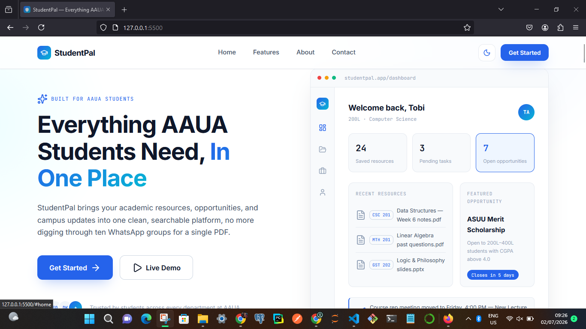
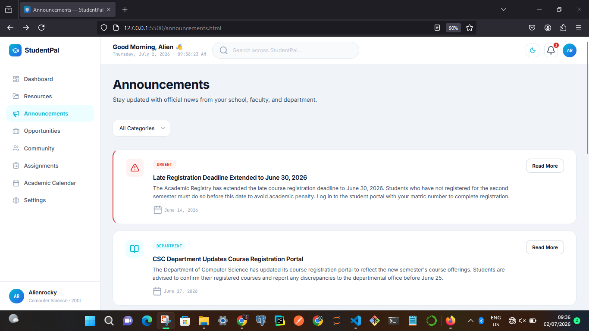
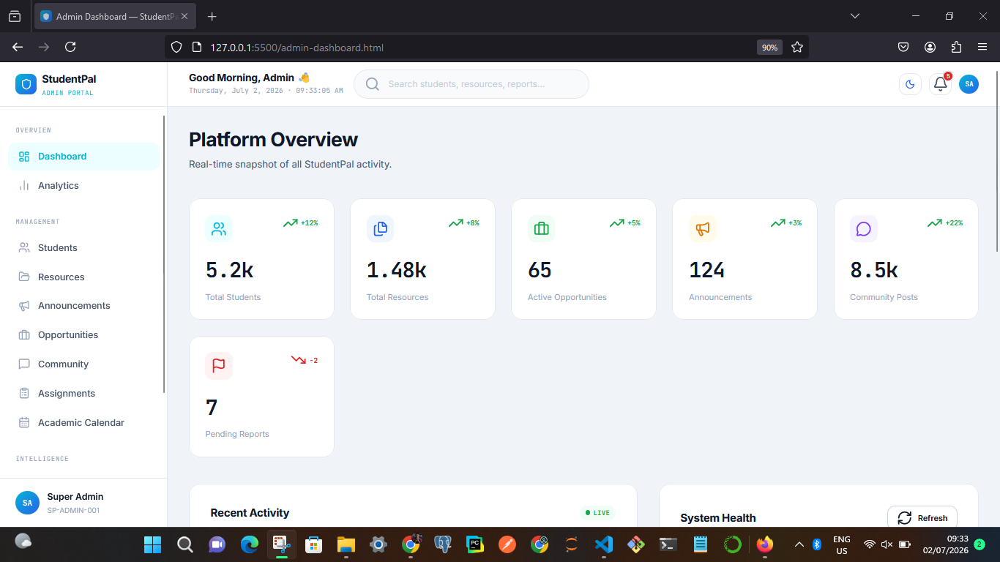

🎓 StudentPal

«A centralized academic platform built for the Faculty of Computing, Adekunle Ajasin University, Akungba-Akoko (AAUA).»

StudentPal is a modern web platform designed to simplify academic life by bringing lecture notes, past questions, faculty announcements, academic opportunities, assignments, and student services into one place.

The project was conceived to solve real challenges experienced by students in the Faculty of Computing and was already under active development before being selected for the DevCareer × Nomba Hackathon Build Phase.

---

Table of Contents

- About
- Problem Statement
- Solution
- Features
- System Roles
- Technology Stack
- Project Structure
- Installation
- Screenshots
- Roadmap
- Future Improvements
- Author
- License

---

📌 Problem Statement

Students within the Faculty of Computing often struggle with:

- Finding lecture notes and handouts.
- Accessing past examination questions.
- Missing faculty announcements.
- Discovering internships, scholarships and competitions.
- Keeping track of academic deadlines.
- Switching between multiple WhatsApp groups and platforms just to find important information.

This scattered system wastes time and causes students to miss valuable academic opportunities.

---

💡 Solution

StudentPal provides one centralized platform where students can:

- Access verified academic resources.
- Stay informed with faculty announcements.
- Discover internships and scholarship opportunities.
- Track important academic dates.
- Engage with fellow students.
- Search resources quickly using AI-powered search (currently in development).

---

✨ Features

👨‍🎓 Student Features

- Secure Registration
- Secure Login
- Personalized Dashboard
- Browse Academic Resources
- Download Lecture Notes
- Download Past Questions
- View Faculty Announcements
- Browse Opportunities
- Academic Calendar
- Community Discussions
- User Profile Management
- Light & Dark Theme

---

👨‍💼 Admin Features

- Admin Dashboard
- Upload Lecture Notes
- Upload Past Questions
- Manage Resources
- Create Announcements
- Manage Opportunities
- Manage Assignments
- Manage Students
- Platform Analytics

---

🤖 AI Features (In Development)

StudentPal is being enhanced with Artificial Intelligence to improve the student experience.

Planned AI capabilities include:

- AI Resource Search
- Intelligent Resource Recommendations
- Smart Search
- AI Study Assistant

---

👥 User Roles

Student

Students can:

- View Resources
- Download Files
- View Announcements
- Browse Opportunities
- Participate in Community Discussions
- Manage Their Profile

Students cannot:

- Upload Resources
- Create Announcements
- Manage Other Users

---

Admin

Administrators can:

- Upload Resources
- Manage Resources
- Publish Announcements
- Manage Opportunities
- Moderate Community Content
- View Platform Analytics

---

🛠 Technology Stack

Frontend

- HTML5
- CSS3
- JavaScript

Backend

- Django
- Django REST Framework (DRF)

Authentication

- JWT Authentication

Database

- SQLite (Development)

Version Control

- Git
- GitHub

---

📂 Project Structure

StudentPal/
│
├── frontend/
│   ├── index.html
│   ├── login.html
│   ├── register.html
│   ├── student-dashboard.html
│   ├── admin-dashboard.html
│   ├── resources.html
│   ├── announcements.html
│   ├── opportunities.html
│   ├── assignments.html
│   ├── academic-calendar.html
│   ├── settings.html
│   │
│   ├── css/
│   ├── js/
│   └── assets/
│
├── backend/
│   ├── accounts/
│   ├── resources/
│   ├── announcements/
│   ├── opportunities/
│   ├── community/
│   └── manage.py
│
└── README.md

---

⚙️ Installation

Clone the repository

git clone https://github.com/rockytiM-5205/student_pal-ver1.git

Navigate into the project

cd student_pal-ver1

Backend Setup

python -m venv venv

Activate the virtual environment.

Install dependencies:

pip install -r requirements.txt

Run migrations:

python manage.py migrate

Start the development server:

python manage.py runserver

Open the application in your browser.

---

## Screenshots

### landing page

### signup page

### dashboard page

### admin_dashboard page

🚧 Project Status

StudentPal is currently in active development.

✅ Completed

- Landing Page
- Responsive Design
- Login Interface
- Registration Interface
- Student Dashboard UI
- Admin Dashboard UI
- Resources UI
- Announcements UI
- Opportunities UI
- Academic Calendar UI
- Shared CSS Design System

🔄 In Progress

- Django Backend Integration
- REST API Development
- Authentication
- Admin Resource Upload
- Student Resource Download
- AI Resource Search

---

🗺 Roadmap

Phase 1

- Faculty of Computing Platform
- Authentication
- Resource Management
- Announcements
- Opportunities

Phase 2

- AI Resource Search
- AI Study Assistant
- Smart Recommendations
- Email Notifications

Phase 3

- Expand to other faculties within AAUA
- Mobile Application
- Multi-Faculty Support

---

🌟 Future Improvements

- AI-powered Search
- Semantic Search
- Push Notifications
- Email Verification
- Mobile Application
- Real-time Messaging
- Smart Academic Recommendations
- Faculty Discussion Forums

---

🤝 Contributing

Contributions, suggestions, and feedback are welcome.

Feel free to fork the repository, create a feature branch, and submit a pull request.

---

👨‍💻 Author

Agbaje Peter Oluwatimilehin (Alienrocky)

Faculty of Computing
Adekunle Ajasin University, Akungba-Akoko (AAUA)

Built with passion to improve the academic experience of students and continuously enhanced through the DevCareer × Nomba Hackathon Build Phase.

---

📄 License

This project is released under the MIT License.

You are free to use, modify, and distribute this project in accordance with the terms of the license.
